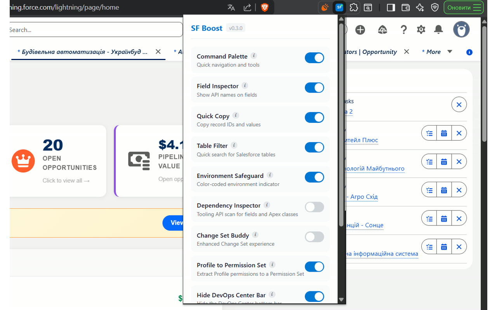
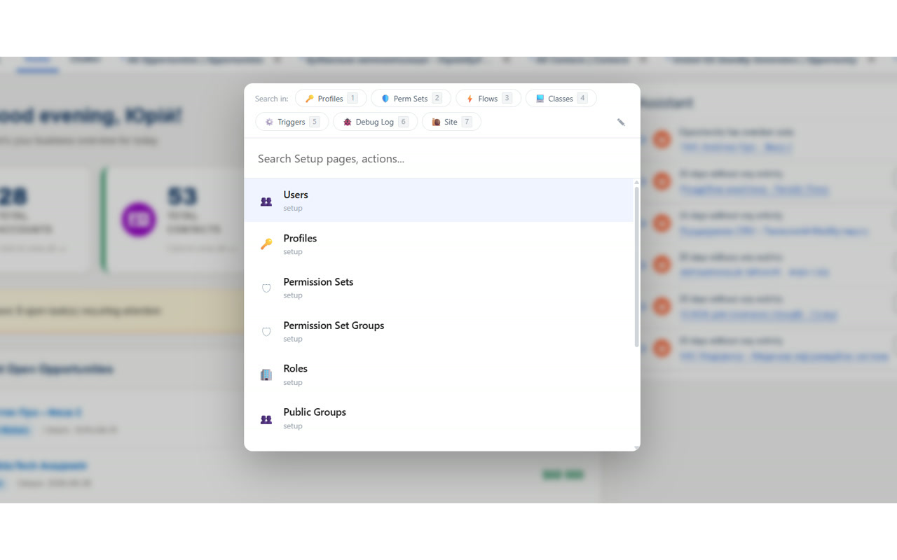
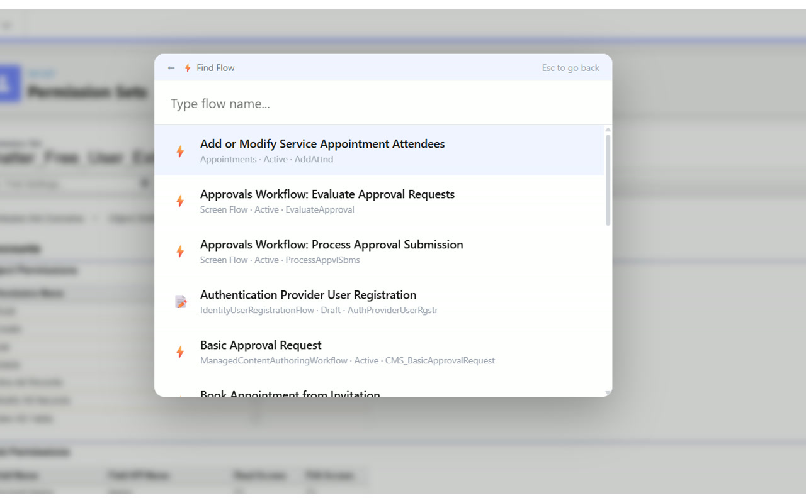
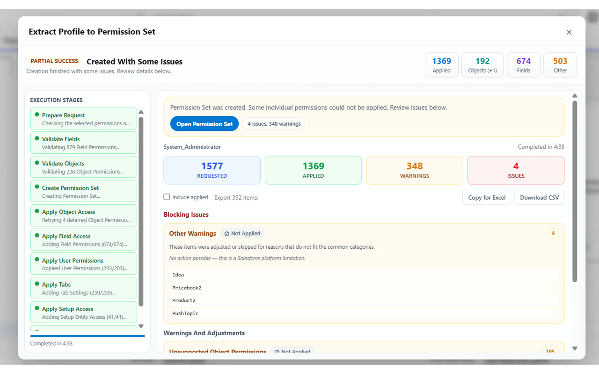

# SF Boost — Salesforce Productivity Toolkit

[](https://github.com/nocebov/sf-boost-chrome/actions/workflows/ci.yml)
[](LICENSE)
[](CHANGELOG.md)

**SF Boost** is a Chrome Extension focused on one job: making everyday Salesforce admin and developer work faster inside the native UI.

> Built with [WXT](https://wxt.dev/) · TypeScript · Bun



---

## Modules

### Command Palette `Alt+Shift+S`

Jump anywhere in Setup — or search Salesforce metadata — without clicking through menus.

Press `Alt+Shift+S`, start typing, hit Enter. Works for:
- **70+ Setup pages** — Users, Profiles, Roles, Permission Sets, Object Manager, Picklist Value Sets, Fields, Apex Classes, Triggers, LWC, Visualforce, Debug Logs, Developer Console, Reports, Dashboards, and more
- **Quick Actions** — copy your current Record ID or Page URL directly from the palette
- **Quick Action pills** (press number keys `1`–`7` on empty input):
  1. **Profile Search** — SOQL-powered search across all Profiles
  2. **Permission Set Search** — search across all custom Permission Sets
  3. **Flow Search** — search across all flows with type labels (Screen Flow, Autolaunched, Scheduled, etc.)
  4. **Apex Class Search** — Tooling API search across all Apex Classes
  5. **Apex Trigger Search** — Tooling API search across all Apex Triggers
  6. **Toggle Debug Log** — enable/disable a 30-minute FINEST debug log for the current user
  7. **SOQL Query** — type and run ad-hoc SOQL queries, click a result to copy its ID

Navigate with arrow keys, confirm with Enter, close with Escape. Backspace on empty input exits a sub-mode.





---

### Field Inspector `Alt+Shift+F`

See field API names directly on any record page — no more digging through Object Manager.

Press `Alt+Shift+F` or click the `{ }` button in the bottom-right corner. Blue API name badges appear next to every field label. **Hover** the badge to see the field type and whether it's required. **Click** the badge to copy the API name to clipboard instantly.

---

### Quick Copy

One-click copy of Record IDs on record pages and list views.

- **Record pages** — a small clipboard icon appears next to the record header. Click it and the 18-character ID is in your clipboard.
- **List views** — a "Copy ID" pill appears on row hover. Click it to copy that row's record ID.

---

### Table Filter

Instant search over any Salesforce table — Setup lists, List Views, Classic tables.

A search bar is automatically injected above supported tables. Type to filter rows in real-time (no page reload). Supports multi-term search (space-separated terms, all must match). Shows a live `filtered / total` row count. Clear with the × button or Escape key. Matched text is highlighted in yellow.

**Smart row loading:** On Lightning tables with lazy-loaded rows, Table Filter automatically scrolls the container to hydrate all rows before filtering. On Classic pages with pagination, it auto-selects the maximum "records per page" option.

---

### Environment Safeguard

A color-coded badge in the top-left corner that tells you exactly which org you're in — before you accidentally do something in Production.

| Environment | Color |
|---|---|
| Production | Red |
| Sandbox | Orange / Amber |
| Developer | Green |
| Scratch | Teal / Cyan |
| Trailhead | Purple |

Updates the browser tab title with an environment prefix (`[PROD]`, `[SBX: name]`, `[DEV]`, `[SCRATCH]`, `[TRAIL]`). Supports custom labels, badge colors, and text colors per org via `chrome.storage.sync`. The badge is automatically hidden on Flow Builder pages to avoid canvas overlap.

---

### Profile → Permission Set

Extract permissions from any Profile and create a new Permission Set — without writing a single line of code.

Open any Profile page (Enhanced or Classic) and click **"Extract to Permission Set"**. A wizard walks you through:

1. **Loading** — reads all profile permissions in parallel (objects, fields, user perms, tabs, Apex/VF/Custom access)
2. **Selection** — shows a summary of the profile (name, counts). Each permission type gets a collapsible section with Select All and individual checkboxes. Permission flags displayed inline (R/C/E/D/VA/MA for objects; Read/Edit for fields; visibility for tabs)
3. **Name** — pre-filled with `{ProfileName}_Extracted`, validates API naming rules, checks for duplicate names via Tooling API
4. **Execution** — a 10-stage progress view with live status: Prepare → Validate Fields → Validate Objects → Create PermSet → Apply Object Access → Apply Field Access → Apply User Permissions → Apply Tabs → Apply Setup Access → Finish
5. **Result** — success/failure banner with a direct link to the new Permission Set. Notices grouped by type (converted to read-only, missing fields, non-permissionable, auto-resolved dependencies, etc.). Export options: **Copy for Excel** (tab-separated) and **Download CSV**



> Disabled by default — enable in the extension popup.

---

### Deep Dependency Inspector

Find where an Object Manager field or Apex class is used across the org without writing SOQL.

On Object Manager field pages or Apex Class pages, a **"Deep Scan"** button appears. Click it to query `MetadataComponentDependency` via the Tooling API. Results are displayed in a modal, grouped by component type (Flows, Apex Classes, Triggers, LWC, Validation Rules, Layouts, FlexiPages, etc.) with icons and counts. Sections are collapsible. Click an item to copy its name; use "Copy All" for the full list.

> Disabled by default — enable in the extension popup.

---

### Change Set Buddy

Filter large Change Set component lists without scrolling.

On Outbound/Inbound Change Set pages, a search bar is injected above the component table. Supports multi-term search and shows a live `filtered / total` item count. A **component type counter** displays the top 3 component types and their counts (e.g. `5 ApexClass, 3 CustomObject, 2 ValidationRule`). Matched text is highlighted in yellow.

> Disabled by default — enable in the extension popup.

---

### Hide DevOps Bar

Removes the DevOps Center navigation bar from all Salesforce pages if you don't use it.

> Disabled by default — enable in the extension popup when you explicitly want it.

Once enabled, the bar is hidden via CSS injection and stays hidden across SPA navigations. A MutationObserver catches dynamically added DevOps bar elements.

---

## Installation & Development

```bash
# Install dependencies
bun install

# Type-check
bun run check

# Development server (auto-reloads on changes)
bun run dev

# Build for production
bun run build

# Run popup/content smoke test against the built extension
bun run test:smoke

# Package for Chrome Web Store
bun run zip
```

Load the unpacked extension from `.output/chrome-mv3/` in `chrome://extensions` with Developer Mode on.

---

## Data Handling

- SF Boost reads the current Salesforce session cookie (`sid`) locally so it can make Salesforce REST and Tooling API calls against the active org.
- The `sid` cookie is read only inside Chrome via the `cookies` permission. It is used to authenticate direct requests from the extension to Salesforce, not to any developer-operated backend.
- API-assisted features run only against the org open in the active Salesforce tab.
- SF Boost does not send Salesforce data to third-party servers.
- Settings are stored in `chrome.storage.sync`, and describe-cache data is stored in `chrome.storage.local`.
- The extension is built around a single purpose: improving day-to-day Salesforce admin and developer workflows inside the native Salesforce UI.

Store submission artifacts:
- Privacy policy: [docs/privacy-policy.md](docs/privacy-policy.md)
- Reviewer notes: [docs/reviewer-notes.md](docs/reviewer-notes.md)
- Support: [docs/support.md](docs/support.md)
- Admin packet: [docs/admin-packet.md](docs/admin-packet.md)
- Release checklist: [docs/store-release-checklist.md](docs/store-release-checklist.md)

---

## Tech Stack

- **[WXT](https://wxt.dev/)** — Chrome Extension framework with HMR
- **TypeScript** — full type safety across all modules
- **Bun** — fast package manager and runtime
- **Salesforce REST & Tooling APIs** — for metadata search, Debug Log toggle, Dependency Inspector, and Profile extraction

---

## Contributing

Contributions are welcome! Please read the [Contributing Guide](CONTRIBUTING.md) before submitting a PR.

- [Report a bug](https://github.com/nocebov/sf-boost-chrome/issues/new?template=bug_report.md)
- [Request a feature](https://github.com/nocebov/sf-boost-chrome/issues/new?template=feature_request.md)

## License

[MIT](LICENSE)

---

*Built for speed. Designed for Salesforce pros.*
